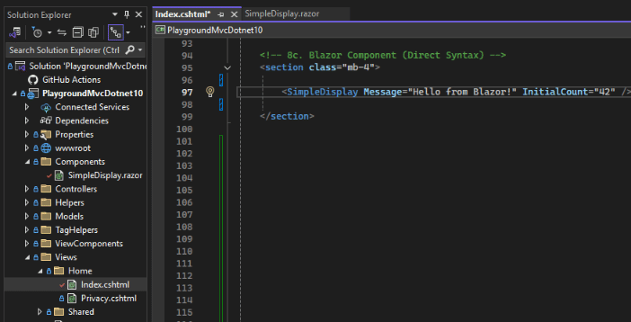
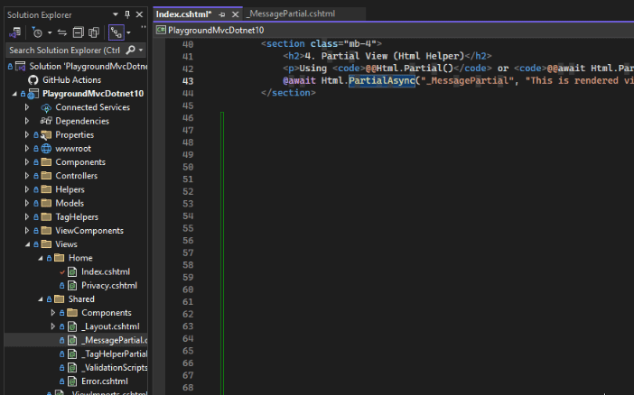

# Jump To File At Cursor - VisualStudio Extension

> Using a hotkey, it will jump to the filename at the cursors position

Jump to:
- Blazor Component file
- Razor file
- ViewModel file
- Partial file
- Css file
- JavaScript file
- Any file by the same name that the cursor is placed over

**Works for:** Visual Studio 2022 / 2026

A small Visual Studio extension that makes it easy to jump to a file whose name is under the text caret. This is especially useful in ASP.NET MVC/Razor views where filenames are referenced in markup and it's otherwise tedious to locate the corresponding file in Solution Explorer.

**Example:** Using a hotkey, it will jump to the filename at the cursors position

**Example:** Using a hotkey, it will jump to the filename at the cursors position

# Download
You can download the latest release here: [Download](Release.zip)

Double click and install: JumpToFileAtCursorVisualStudioExtension.vsix

## Problem

In MVC views and Razor files you frequently reference partials, view names or other files by name. Visual Studio does not provide a simple, consistent way to jump from the caret to the referenced file. Manually searching Solution Explorer or using the Go To dialog is slow.

## What this extension does

- Detects the full token under the caret (letters, digits, `-` and `_`) and searches the current solution for a matching file or project item.
- If a matching file is found it opens that file.
- If no match is found it falls back to Visual Studio's built-in `Edit > Go To > Go To File...` dialog.
- Works well for typical MVC scenarios such as view names, partials and view models referenced in code or markup.

## What this extension does Not do
- You can not click with the mouse and jump - it only works with hotkey.

## Usage

1. Place the caret on or inside a filename/token in an open editor window (e.g. `PartialView`, `User-List`, `UserViewModel`).
2. Trigger the command from the Tools menu or use the configured key binding `Ctrl+Shift+O`.
3. The extension will open the matched file if found; otherwise it will open the `Go To File` dialog for manual search.

## Keyboard shortcut

The default key binding is `Ctrl+Shift+O`. You can rebind it in Visual Studio's Keyboard options if you prefer a different shortcut.

**To change the hotkey:**
1. Go to `Tools` > `Options` in Visual Studio.
2. Expand the `Environment` section and select `Keyboard`.
3. In the `Show commands containing:` box, type `JumpToFileAtCursor`.
4. Select the command (e.g., `Tools.JumpToFileAtCursor`).
5. In the `Press shortcut keys` box, press your desired key combination.
6. Click `Assign`, then `OK` to save your changes.

You can now use your custom shortcut to trigger the extension.

## Build / Install

- This project targets .NET Framework 4.8 and is implemented as a VSIX extension.
- To build from source open the solution in Visual Studio (with the VS SDK installed) and build the `JumpToFileAtCursorVisualStudioExtension` project.
- Install the generated `.vsix` to add the command to Visual Studio.

## Contributing

Contributions and issues are welcome. Please open a PR or issue on the repository.

## License

MIT - see the repository for details.

---

# Keywords - For search engines
- IntelliSense Blazor / Razor file navigation not working in Visual Studio
- Visual Studio extension
- jump to file
- go to file
- go to symbol
- file navigation
- hotkey file navigation
- MVC view productivity
- Razor file navigation
- Blazor component navigation
- partial view navigation
- ViewModel navigation
- C# productivity
- .NET developer tools
- Solution Explorer alternative
- Visual Studio hotkey
- jump to referenced file
- code navigation
- VSIX extension
- ASP.NET MVC tools
- Visual Studio plugin
- developer productivity
- open file at cursor
- jump to file at cursor
- Visual Studio code tools
- file lookup extension
- quick file open
